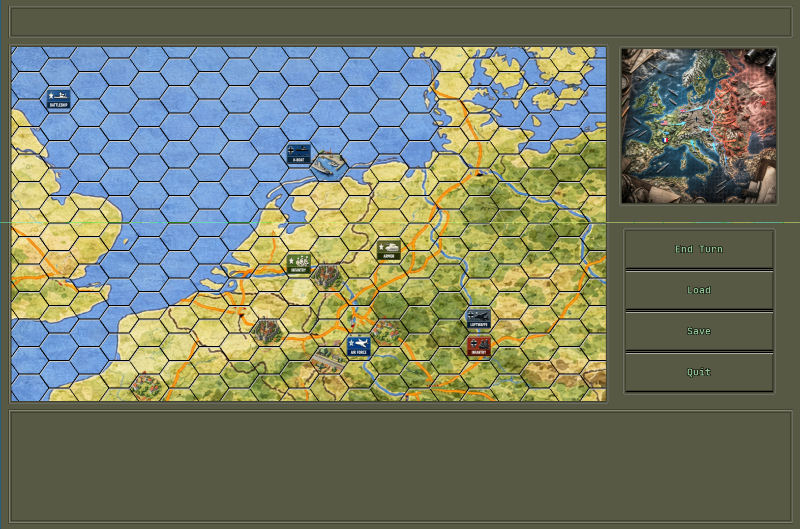

# pyhex

[](https://www.python.org/downloads/release/python-3100/)
[](https://www.pygame.org/news)
[](https://opensource.org/licenses/MIT)
[](https://github.com/psf/black)
[](https://github.com/infaktum/pyhex/actions/workflows/ci-tests.yml)
[](https://codecov.io/gh/infaktum/pyhex)

`pyhex` is a small Python library for working with hexagonal grids and simple rendering utilities. It
contains logic for creating and manipulating hex grids, low-level drawing helpers, and a lightweight renderer
that can be used with `pygame`.

In short: suitable for games, tile-map editors, simulations, and visualizations that use hex tiles.



## Main features

- Mathematical operations and coordinate transformations (axial / offset) and neighborhood queries.
- Low-level drawing helpers: `hex_corner`, `hex_corners`, point-in-polygon checks.
- Layers and rendering API (`pyhex.hexagons.Layer(s)`, `pyhex.renderer.Renderer`) for rendering multiple layers (grid,
  color map, color layer).

> Note: The README describes the API of the current implementation in `pyhex/graphics.py`, `pyhex/hexagons.py` and
> `pyhex/renderer.py`.

## Requirements

- Python 3.8+ (tested with Python 3.8–3.12 — please adapt to your target environment if needed)
- Pygame (used by the example modules)

Install dependencies, e.g. inside a virtual environment:

```powershell
python -m venv .venv
.\.venv\Scripts\Activate.ps1
pip install pygame
```

If you want to use the package locally in editable mode:

```powershell
pip install -e .
```

## Quickstart / Examples

The examples below show common usage patterns based on the available API.

screen.blit(surface, (0, 0))

1) Simple hex grid with `HexGridManager` and `HexGridRenderer` (Pygame)

```python
from pyhex.hexagons import rectangle_map, HexagonalGrid
from pyhex.layers import HexGridManager, HexGridLayer
from pyhex.render import HexGridRenderer
import pygame

pygame.init()

ROWS, COLS, RADIUS = 6, 10, 50
hexes = rectangle_map(ROWS, COLS)
hexgrid = HexagonalGrid(hexes)

# create a manager and a simple grid layer
manager = HexGridManager(hexgrid)
grid_layer = HexGridLayer("grid", hexgrid)
manager.add_layer(grid_layer)

renderer = HexGridRenderer(manager, radius=RADIUS)
screen = pygame.display.set_mode(renderer.screen_size)

# render once and blit to the screen
renderer.render()
screen.blit(renderer.surface, (0, 0))
pygame.display.flip()

# simple event loop (keep the window open)
running = True
while running:
    for event in pygame.event.get():
        if event.type == pygame.QUIT:
            running = False
            pygame.quit()
```

screen.blit(surface, (0, 0))

2) Using `HexGridManager`, styled layers and the `HexGridRenderer`

```python
from pyhex.hexagons import rectangle_map, HexagonalGrid
from pyhex.layers import HexGridManager, FillGridLayer, OutlineGridLayer
from pyhex.render import HexGridRenderer
import pygame

pygame.init()
ROWS, COLS, RADIUS = 15, 20, 40
hexes = rectangle_map(ROWS, COLS)
hexgrid = HexagonalGrid(hexes)

# manager collects layers
manager = HexGridManager(hexgrid)

# background fill layer (default color) and an outline grid
color_layer = FillGridLayer("background", hexgrid, default_color=(200, 200, 255, 255))
# set a single tile to red as an example
color_layer.set_color((5, 5), (255, 0, 0, 255))

grid_layer = OutlineGridLayer("grid", hexgrid, default_color=(0, 0, 0), default_width=1)

manager.add_layer(color_layer)
manager.add_layer(grid_layer)

renderer = HexGridRenderer(manager, RADIUS)
screen = pygame.display.set_mode(renderer.screen_size)

renderer.render()
screen.blit(renderer.surface, (0, 0))
pygame.display.flip()
```

3) Low-level functions

- hex_corner(center, size, i, pointy=False): compute a corner of a hex
- hex_corners(center, size, pointy=False): returns 6 corners
- point_in_polygon(x, y, poly): point-in-polygon test

These helpers live in `pyhex.graphics` and `pyhex.hexagons`.

## Logging

pyhex follows the common convention for libraries: it does not configure output handlers itself and by default
attaches a `logging.NullHandler` to the package logger. This avoids producing log messages unless the calling
application configures logging. That gives applications full control over formatting, level and destination of logs.

Recommendations for applications:

- Configure logging in the application (for example in `main.py`) with `logging.basicConfig()` or by adding custom
  handlers/formatters to `logging.getLogger('pyhex')`.
- To see pyhex internal debug logs, set the level for the `pyhex` logger to `DEBUG`.

Example (Python):

```python
import logging
import pyhex

# Application-level logging configuration
logging.basicConfig(level=logging.INFO,
                    format="%(asctime)s [%(levelname)s] %(name)s: %(message)s")

# Make pyhex logs more verbose when needed
logging.getLogger('pyhex').setLevel(logging.DEBUG)

# Optionally initialize pyhex with the same level
pyhex.init(orientation=pyhex.Orientation.FLAT, log_level=logging.DEBUG)
```

PowerShell (setup & run):

```powershell
python -m venv .venv
.\.venv\Scripts\Activate.ps1
pip install -r requirements.txt
python examples\02_token_game\main.py
```

Note: The example scripts in `examples/` already include a simple logging configuration so that running them
produces sensible output.

## Module / API overview

(pyhex currently contains three primary files in the package folder — here are the most important available
classes/functions)

- pyhex.graphics
    - Hex: representation of a cell (row, col, center, size, edges, fill_color)
    - HexGrid(rows, cols, hex_size, line_color, line_width, fill_color): grid with a `draw(surface)` method;
      conversion methods `xy_to_rq`, `rq_to_xy`, `get_hex_at`, `neighbors`, `distance`.
    - Helper functions: `hex_corner`, `hex_corners`, `point_in_polygon`, `axial_to_offset`, `offset_to_axial`.

- pyhex.hexagons
    - Hexagon / Hexagons: alternative data structures (similar to graphics).
    - Layer, GridLayer, ColorLayer, ColorMapLayer, Layers: simple layer objects for storing color/display properties.

- pyhex.renderer
    - Renderer(layers, hex_size): creates an internal hex layout and provides `render(surface)` as well as
      `render_layer`, `render_grid` and `render_color`.

Note: The implementation is intentionally simple and targets Pygame as a rendering backend, but it can be adapted
for other surfaces.

## Development

Recommended development setup (Windows PowerShell):

```powershell
python -m venv .venv
.\.venv\Scripts\Activate.ps1
pip install -e .[dev]
pip install -r requirements-dev.txt  # optional, if present
```

Recommended tools:

- pytest for tests
- black / flake8 / pylint for formatting and linting
- pre-commit hooks for automatic formatting (optional)

Tests: Put tests in `tests/`. Useful small tests include:

- Grid creation, size and `compute_screen_size()`
- Conversion functions `rq_to_xy` / `xy_to_rq`
- `neighbors()` and `distance()`

CI: Use GitHub Actions with a Python matrix for automated testing and linting.

## License

No license file is currently included in the repository. (Consider adding one.)

Suggested license: MIT — if you like, add a `LICENSE` file with the MIT text.

## Contact / Further links

- Repo: (add your GitHub link here)
- Issues: (open issues in the repo for bugs/feature requests)

---
